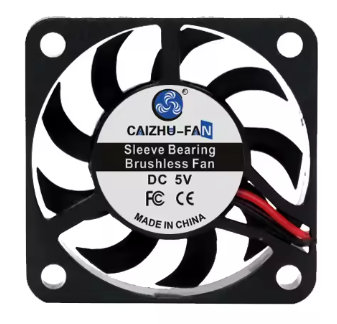
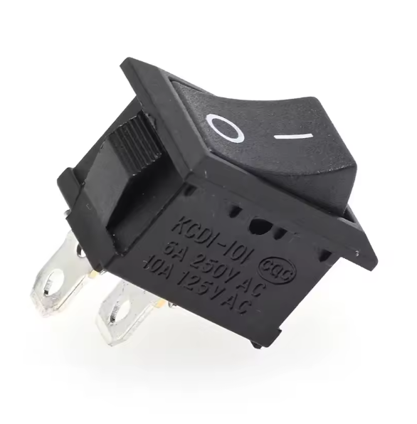
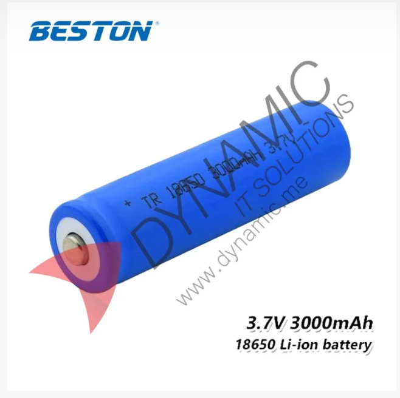

# MINDSCAPE 1 | WRO - FUTURE ENGINEERS | MINDSCAPE ACADEMY

## Team Members 🦋:
Maria Ghanem  
Charbel Ghanem  
Marc Zgheib  

## Content 🤔:
| Folder | Content | 
| -- | -- |
| [Team Photos](Team%20Photos)| [Official team photo](Team%20Photos/Official%20Team%20Photo.jpg), [Funny team photo](Team%20Photos/Funny%20Team%20Photo.jpg) |
| [Vehicle Photos](Vehicle%20Photos) | [Bottom view](Vehicle%20Photos/bottom.jpg), [front view](Vehicle%20Photos/front.jpg), [left view](Vehicle%20Photos/left.jpg), [rear view](Vehicle%20Photos/rear.jpg), [right view](Vehicle%20Photos/right.jpg), [top view](Vehicle%20Photos/top.jpg) |
| [Models](Models) | [Final base model](Models/Final_build.jpg), [final camera holder model](Models/Camera_holder.jpg), [base plate](Models/Base_plate.jpg), [steering mechanism](Models/Steering.jpg) |
| [Other](Other) | [Images used in documentation](Other/used_pictures) |
| [Schemes](Schemes) | [General connections schematic](Schemes/scheme.jpg), [camera schematic](Schemes/Camera%20Connection.jpg) |
| [Src](Src) | [Obstacle challenge final](Src/ObstacleChallenge.py), [open challenge final](Src/OpenChallengeFinal.py), [HSV finder](Src/HSVRange.py), [test files](Src/Tests) |
| [Video](Video) | [Open challenge](Video/README.md), [obstacle challenge](Video/README.md) |

## Task 📔:

The self-driving car challenge in this season is a Time Attack race: there will not be multiple cars at the same time on the track. Instead, one car per attempt will try to achieve the best time by driving several laps fully autonomously in two different challenges.

**OBJECTIVE:** Build an autonomous vehicle that can complete 3 laps per round of the two challenges, the open challenge and the obstacle challenge.

### Open Challenge 🗺️:

 

 
Open Challenge Field

In this challenge, the robot has to drive around the map for 3 laps without any obstacles in the way. Instead, the inner wall of the map varies in size for every round that the robot parcours. This requires the robot to have a dynamic code that is able to recognize the field it is operating in. 

### Obstacle Challenge 🔴🟢:

 
Obstacle Challenge Field

To complete the second challenge, the robot must perform 3 full laps around the map with red and green traffic signs spread randomly across the canvas whilst driving in the correct lane around each one. In addition, the last block at the end of the second lap determines the direction that the robot continues in for its third lap. If that block was to be red, the robot has to continue in the opposite direction but, if that block was to be green, it continues as it is to then try to parallel park in the designated area at the end of lap 3. Keep in mind that the whole mission should be done without knocking down any of the traffic signs.

## Engineering Materials:

### Vehicle Base
- 3D printed model from scratch 
 

- [DC Car Motor](https://dynamic.me/dc-car-motor?search=dc%20motor) 
 

- [DC Motor Driver](https://ar.aliexpress.com/item/1005008473346114.html?spm=a2g0o.productlist.main.6.44575z365z36NT&aem_p4p_detail=202507170731044138705799953300000597458&algo_pvid=c8a85365-c6c5-4247-a63d-28dc5cab4892&algo_exp_id=c8a85365-c6c5-4247-a63d-28dc5cab4892-5&pdp_ext_f=%7B%22order%22%3A%221%22%2C%22eval%22%3A%221%22%7D&pdp_npi=4%40dis%21LBP%21106714.58%21106714.58%21%21%218.50%218.50%21%40212a6e3217527626641502197e1624%2112000045300325842%21sea%21LB%210%21ABX&curPageLogUid=DhMzlXalJyT4&utparam-url=scene%3Asearch%7Cquery_from%3A&search_p4p_id=202507170731044138705799953300000597458_2) 
 

- [Servo Motor](https://dynamic.me/servo-motor-mg995-13-kg?search=mg995%20servo%20motor) 
 

- [8V-35V to 5V 8A Converter](https://ar.aliexpress.com/item/1005006100140233.html?gatewayAdapt=glo2ara) 
 

- [Sony IMX219 Camera Module 2](https://dynamic.me/raspberry-pi-camera-8-megapixel-original?search=raspberry%20camera) 
 

- [5V Fans](https://ar.aliexpress.com/item/1005004985275700.html?spm=a2g0o.productlist.main.14.edd92040d5hroO&aem_p4p_detail=202507170756503545023921382790000442031&algo_pvid=c2980710-1dbc-4307-8720-5841941ced6f&algo_exp_id=c2980710-1dbc-4307-8720-5841941ced6f-13&pdp_ext_f=%7B%22order%22%3A%22124%22%2C%22eval%22%3A%221%22%7D&pdp_npi=4%40dis%21LBP%21227614.75%2188715.99%21%21%212.54%210.99%21%40212a6e2917527642103936950e571b%2112000031243799338%21sea%21LB%210%21ABX&curPageLogUid=Redx4SG53EQe&utparam-url=scene%3Asearch%7Cquery_from%3A&search_p4p_id=202507170756503545023921382790000442031_4) 
 

- [SPST ON/OFF 2 Position Mini Boat Rocker Switch](https://ar.aliexpress.com/item/1005008778176373.html?spm=a2g0o.productlist.main.2.e15b4aacODWQdM&aem_p4p_detail=2025071709452110561894286444870000684793&algo_pvid=71046b99-6677-4321-8750-e395dff1f86c&algo_exp_id=71046b99-6677-4321-8750-e395dff1f86c-1&pdp_ext_f=%7B%22order%22%3A%22310%22%2C%22eval%22%3A%221%22%7D&pdp_npi=4%40dis%21LBP%21665396.78%21425853.94%21%21%2153.00%2133.92%21%40212e508f17527707215351343ed6cc%2112000046629830173%21sea%21LB%210%21ABX&curPageLogUid=1sXACyRTM0K7&utparam-url=scene%3Asearch%7Cquery_from%3A&search_p4p_id=2025071709452110561894286444870000684793_1) 
 

- [Push Button](https://dynamic.me/big-button-light-touch-switch?search=button) 

- Raspberry Pi 5 

- [3.7V Battery Holder](https://dynamic.me/battery-holder-case-3-18650?search=battery&page=2) 
 

- [3.7V Battery](https://dynamic.me/beston-battery-li-ion-rechargeable-3-7-v-3000-mah-18650?search=3.7V%20battery) 

  

## Assembly Guide:
### Software:

**1. Raspberry Pi OS:**
- Download and install the official Raspberry Pi Imager from [https://www.raspberrypi.com/software/]

**2. Connecting to the Raspberry Pi 5:**
- This step can be done in 2 ways:  

    a. Using the MicroHDMI and USB 3.0 Ports: 
    - Connect the Raspberry Pi to a monitor using an HDMI cable with a MicroHDMI head. 
    - Use the USB 3.0 ports on the Raspberry Pi to connect a seperate mouse and keyboard. 

    b. Using a laptop as a display: 
    - Open the Raspberry Pi terminal and run `sudo raspi-config`.
    - Go to `Interface Options > VNC > Enable`.
    - Connect the laptop to the Pi via Ethernet cable.
    - Set a static IP Address on the Pi so that the laptop can easily connect to it using `sudo nano /etc/dhcpcd.conf`.
    - Save and reboot `sudo reboot`.
    - Find the `static IP` on your computer, if it isn't set, enter `arp -a` into Command Prompt.
    - Download and install `RealVNC` on your computer from [https://www.realvnc.com/en/connect/download/viewer/].
    - Launch RealVNC and enter the correct `IP` along with the Pi's `username` and `password`.
    - You should finally see your Raspberry Pi desktop.

     

### Hardware:

**1. Measuring the Components:** 
- Take measurement of the different parts (Raspberry Pi, camera, DC motor, servo motor etc.)   

**2. 3D Modeling:** 
- Start by designing the [model](Models) of the chassis and transferring the files to the 3D printer for construction.  

**3. Chassis Construction:** 
- Obtain the different 3D printed parts of the chassis and glue them tightly together.  

**4. Add the DC Motor:** 
- Add the motor at the [bottom](Vehicle%20Photos/bottom.jpg) of the robot.
- Connect the axle with the wheels.  

**5. Add the Motor Driver:** 
- Place the motor on the front-right corner of the [chassis](Vehicle%20Photos/right.jpg)
- Connect the wires of the DC motor to the OUT1 and OUT2 screws of the driver.  

**6. Add the Servo Motor:** 
- Insert the servo motor through the designated opening at the front.
- Tightly secure the steering axle to it.  

**7. Add the Camera:** 
-  At the highest part of the chassis, install the camera: 
    - Remove the camera cable.
    - Place the camera in the correct position.
    - Connect the cable to the camera.  

**8. Add Cooling Fans:** 
- Above where the Raspberry goes, two 5V fans are secured in place to provide adequate cooling.  

**9. Install the Raspberry Pi:** 
- Place the Raspberry Pi in the correct orientation in the middle of the chassis making sure that the wiring can still be done.  

**10. Add the Power Supply:** 
- Add 3 battery packs around the [rear](Vehicle%20Photos/rear.jpg) of the chassis.  

**11. Wiring the robot:** 
- Refer to the provided [schematic](Schemes/scheme.jpg) to properly wire the electrical components ensuring everything recieves the correct power supply and voltage.  

**12. Last Inspection:** 
- Make sure that all the components are placed correctly and secured tightly to their positions to avoid anything coming undone during the mission.  

**13. Running the Code:** 
- With the construction complete, upload all your code to the Raspberry Pi from the `Src` folder and test the code for proper functionality.  